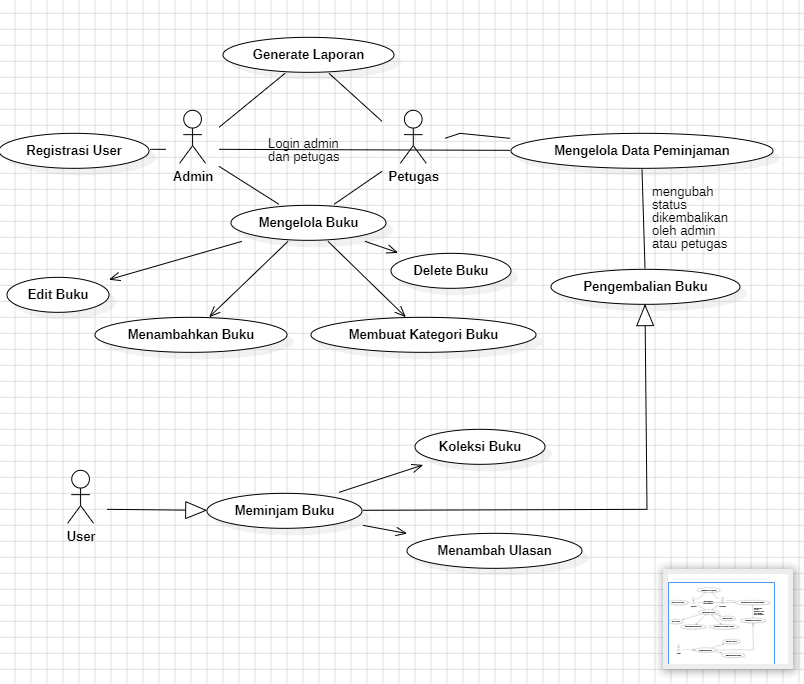

## Perpoostakaan
- PHP 8.2.0
- MySQL
- Laravel 10

## Installasi
- setting extension apache di xampp
- composer install
- setting env
- php artisan key:generate
- php artisan migrate

## Autetinkasi

- /dashboard
   - hanya bisa diakses ketika login sebagai admin

- /home
   - login sebagai user

 ## ERD

 .png)

 ## Use Case

 

